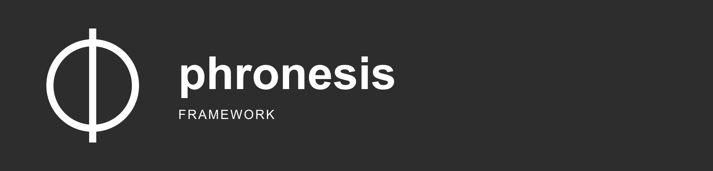

<div align="center">
  
</div>

<div align="center">

# Phronesis Framework - Landing Page

</div>

<div align="center">
  Practical wisdom for AI agent systems.
</div>

<div align="center">
  <a href="src/">source</a>
</div>

<br />

<div align="center">
  <a href="https://go-skill-icons.vercel.app/">
    
  </a>
</div>

---

<div align="center">

## 🎯 Purpose

</div>

A **single multilingual landing page**, not a SaaS marketing site. No signup, no analytics, no third-party tracking, no fabricated social proof. The audience is developers and technical decision-makers evaluating whether to adopt the framework.

- Content is translated into **12 languages** via `next-intl` (RTL aware).
- All page sections are React Server Components; client JavaScript is reserved for genuinely interactive primitives.
- Code snippets are syntax-highlighted at **build time** with Shiki - zero highlighter JS reaches the browser.
- Lighthouse budget: **95+ across all categories**.

<div align="center">

## 🏗️ Architecture

</div>

The implementation is organized in [src/](src/). See the project layout and source code for the component boundaries.

<div align="center">

## 📦 Project layout

</div>

The codebase is organised by **bounded context**, not by file kind. Each subfolder of `src/components/` owns one concern. UI primitives live separately from page sections, layout chrome, and cross-cutting concerns like theme or i18n.

```
src/
├── app/
│   └── [locale]/
│       ├── layout.tsx          # root layout per locale: metadata, fonts, theme provider
│       ├── page.tsx            # the landing page composition
│       ├── icon.tsx            # dynamic favicon
│       └── opengraph-image.tsx # dynamic 1200×630 OG image
├── components/
│   ├── code/                   # CodeBlock, CodeTour, CopyButton
│   ├── i18n/                   # LanguageSwitcher
│   ├── layout/                 # SiteHeader, SiteFooter, MobileMenu, AnnouncementBanner, Logo, nav-data
│   ├── motion/                 # Reveal (IntersectionObserver-driven)
│   ├── sections/               # Hero, Why, CodeTourSection, Patterns, Principles, Inside, Install, Status
│   ├── seo/                    # StructuredData (JSON-LD)
│   ├── theme/                  # ThemeProvider, ThemeToggle
│   └── ui/                     # Container, Section, CardGrid, Eyebrow, IconButton, LinkWithArrow, PillButton
├── hooks/                      # useCopyToClipboard, useDismissible, useMounted, useReveal
├── content/
│   └── snippets.ts             # Phronesis code snippets (single source of truth)
├── i18n/
│   ├── routing.ts              # locale list, default, RTL set
│   └── request.ts              # next-intl request config
├── lib/
│   ├── shiki.ts                # singleton highlighter
│   └── utils.ts                # cn()
└── middleware.ts               # next-intl locale negotiation
```

<div align="center">

## 🛠️ Tech stack

</div>

| Concern           | Choice                                                   |
| ----------------- | -------------------------------------------------------- |
| Framework         | Next.js 16 (App Router, RSC by default, Turbopack)       |
| Language          | TypeScript (strict)                                      |
| Runtime           | React 19                                                 |
| Styling           | Tailwind CSS v4 (CSS-first config, no `tailwind.config`) |
| Primitives        | Radix UI (Dialog, Tabs, Slot)                            |
| Icons             | `lucide-react`                                           |
| Code highlighting | Shiki (server-rendered, zero client JS)                  |
| Fonts             | Geist Sans + Geist Mono via `next/font`                  |
| Theme             | `next-themes` (dark default, no flash)                   |
| i18n              | `next-intl` v4 - 12 locales, RTL support for Arabic      |
| Lighthouse audits | `unlighthouse` (`pnpm lh`)                               |
| Package manager   | `pnpm`                                                   |
| Node              | 22 (LTS) - pinned in [`.nvmrc`](./.nvmrc)                |

<div align="center">

## 🚀 Development setup

</div>

```bash
pnpm install
pnpm dev
```

Open <http://localhost:3000>. You will be redirected to the prefix for the negotiated locale.

<div align="center">

## 🧪 Testing and quality gates

</div>

```bash
npm run typecheck
npm run lint
npm run build
```

<div align="center">

## 🔹 Locales

</div>

| Code | Language  | Code | Language      |
| ---- | --------- | ---- | ------------- |
| `en` | English   | `it` | Italiano      |
| `es` | Español   | `ja` | 日本語        |
| `fr` | Français  | `ko` | 한국어        |
| `de` | Deutsch   | `zh` | 中文          |
| `pt` | Português | `nl` | Nederlands    |
| `ru` | Русский   | `ar` | العربية (RTL) |

Default locale is `en`. The prefix is always present in the URL (`/en/...`, `/es/...`). Translation messages live in [`messages/<locale>.json`](./messages); routing and the RTL set are configured in [`src/i18n/routing.ts`](./src/i18n/routing.ts).

<div align="center">

## 🔹 Scripts

</div>

| Script              | Purpose                                   |
| ------------------- | ----------------------------------------- |
| `pnpm dev`          | Next.js dev server (Turbopack)            |
| `pnpm build`        | Production build                          |
| `pnpm start`        | Serve the production build                |
| `pnpm lint`         | ESLint                                    |
| `pnpm typecheck`    | TypeScript with `--noEmit`                |
| `pnpm format`       | Prettier (write)                          |
| `pnpm format:check` | Prettier (verify)                         |
| `pnpm lh`           | Local Lighthouse audit via `unlighthouse` |

CI runs `lint`, `typecheck`, `format:check`, and `build` on every PR - see [`.github/workflows/ci.yml`](./.github/workflows/ci.yml).

<div align="center">

## 🔹 Import conventions

</div>

- The `@/` alias maps to `src/`.
- Inside a bounded context, sibling imports stay relative (`./logo`, `./nav-data`).
- Across contexts, use `@/components/<bc>/<file>` for clarity.
- Hooks are always `@/hooks/use-xxx`.
- No barrel `index.ts` files - direct imports keep the dependency graph explicit and preserve Next.js tree-shaking.

<div align="center">

## 🔹 Design principles

</div>

- **Polished and honest.** Polished typography, generous whitespace; every claim points to something real.
- **Show code, not screenshots of code.** Real, syntax-highlighted, copy-paste-able snippets - driven from [`src/content/snippets.ts`](./src/content/snippets.ts).
- **No fake testimonials, metrics, or logos.** Until we genuinely have organisations using Phronesis in production with written permission, there is no "Trusted by" section.
- **No third-party tracking.** No analytics, no widgets, no cookie banners.
- **Dark mode default**, light mode toggleable, no flash on load.
- **Performance is part of the message.** Lighthouse 95+ on all metrics. Shiki runs at build time. No motion libraries - animation is a ~40-line `useReveal` hook on top of `IntersectionObserver`.
- **WCAG 2.1 AA.** Semantic HTML, keyboard navigable, visible focus rings, RTL aware.

<div align="center">

## 🔹 Editing content

</div>

| What you want to edit           | Where it lives                                                             |
| ------------------------------- | -------------------------------------------------------------------------- |
| Copy / translations             | [`messages/<locale>.json`](./messages)                                     |
| Code snippets on the page       | [`src/content/snippets.ts`](./src/content/snippets.ts)                     |
| Top-level links (GitHub, docs…) | [`src/components/layout/nav-data.ts`](./src/components/layout/nav-data.ts) |
| Locale list / RTL set           | [`src/i18n/routing.ts`](./src/i18n/routing.ts)                             |
| Section composition / order     | [`src/app/[locale]/page.tsx`](./src/app/[locale]/page.tsx)                 |

<div align="center">

## 🔹 Deployment

</div>

Optimised for Vercel or Cloudflare Pages. `next build` emits prerendered routes for every locale prefix plus dynamic `/icon` and `/opengraph-image`. Configure the deployment platform to serve `.next/`.

<div align="center">

## 📚 Documentation

</div>

The sections in this README document the project setup and usage.

<div align="center">

## 🔬 Scope and status

</div>

Practical wisdom for AI agent systems.

<div align="center">

## 📄 License

</div>

[Apache 2.0](./LICENSE).
